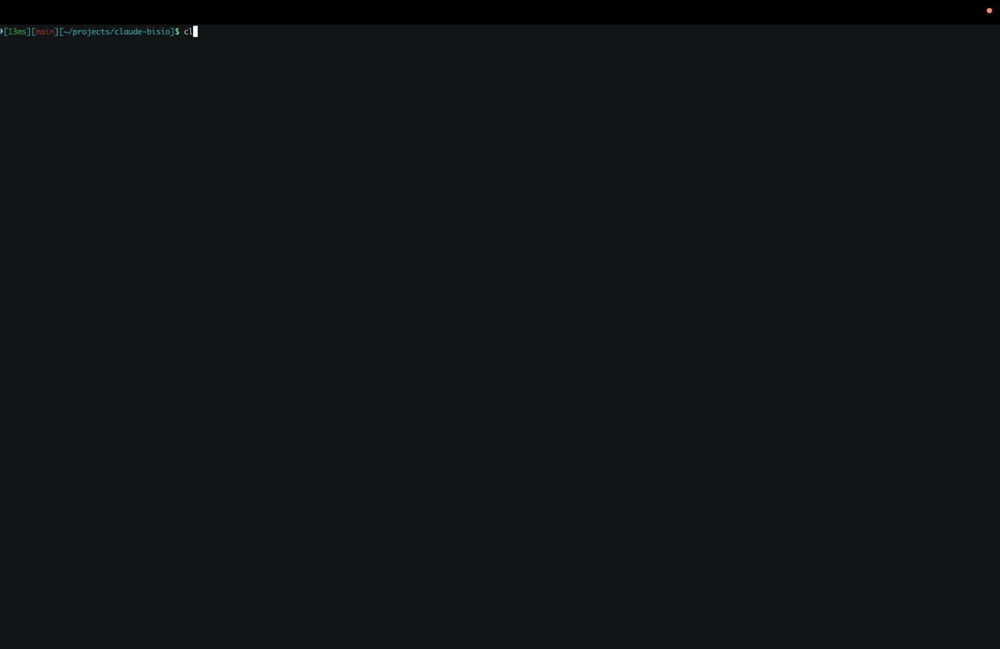

# claude-bisio

Claudio Bisio greets you every time you run `claude`!

A zsh wrapper that prints a Claudio Bisio banner before launching the [Claude Code](https://claude.com/claude-code) CLI. Falls back to a static ASCII portrait if `chafa` isn't installed.

Ships with the [claudiosay](#claudiosay) utility that pipes messages through Bisio's mouth.



## Quick install

One paste - installs `chafa` (via your package manager), clones the plugin to `~/.claude-bisio`, and wires it into `~/.zshrc`:

```sh
curl -fsSL https://raw.githubusercontent.com/Evobaso-J/claude-bisio/main/install.sh | sh
```

Prefer not to pipe `curl` into `sh`? Same result, two steps:

```sh
git clone https://github.com/Evobaso-J/claude-bisio ~/.claude-bisio
~/.claude-bisio/install.sh
```

Then `exec zsh`.

Supported: macOS (Homebrew), Linux (`apt-get` / `dnf` / `pacman` / `zypper` / `apk`). Windows: use WSL.

### Update

Fast-forward pull on the existing clone:

```sh
curl -fsSL https://raw.githubusercontent.com/Evobaso-J/claude-bisio/main/update.sh | sh
```

Or directly: `~/.claude-bisio/update.sh` (equivalently `git -C ~/.claude-bisio pull`).

## Plugin manager install

`chafa` is required - run [`install.sh`](install.sh) once to auto-install it, or see [Requirements](#requirements). Then add one line to `~/.zshrc`:

```sh
# zinit
zinit light Evobaso-J/claude-bisio

# antigen
antigen bundle Evobaso-J/claude-bisio

# zplug
zplug "Evobaso-J/claude-bisio"

# sheldon (~/.config/sheldon/plugins.toml)
[plugins.claude-bisio]
github = "Evobaso-J/claude-bisio"
```

`exec zsh`.

### oh-my-zsh custom plugin

Ensure `chafa` is installed (see [Requirements](#requirements)), then:

```sh
git clone https://github.com/Evobaso-J/claude-bisio \
  "${ZSH_CUSTOM:-$HOME/.oh-my-zsh/custom}/plugins/claude-bisio"
```

Add `claude-bisio` to `plugins=(...)` in `~/.zshrc`. `exec zsh`.

## Usage

After install, run `claude` as usual. Banner prints once per invocation, then the real Claude Code CLI starts. All arguments are forwarded.

```sh
claude --version
claude -p "refactor this function"
```

Standalone preview: `bisio`.

### claudiosay

Who needs `cowsay` when you can replace the cow with Claudio Bisio?
Pass the message as args or pipe it on stdin:

```sh
claudiosay 'solai'
echo 'solai' | claudiosay
git log -1 --format=%s | claudiosay
```

## Disable

Remove the plugin entry (zinit/antigen/zplug/sheldon/oh-my-zsh) or delete the `source` line (manual install) from your config. Bypass for one invocation: `command claude ...`.

## Requirements

- `zsh`
- [`claude`](https://claude.com/claude-code) on `$PATH`
- Interactive terminal (banner auto-skips for pipes and non-TTYs)
- [`chafa`](https://hpjansson.org/chafa/) recommended - installed automatically by `install.sh`. Without it, a static ASCII fallback prints and a one-time install hint is shown.

## Configuration

`chafa` flags live in [`bin/banner.config.sh`](bin/banner.config.sh): symbol set, color depth, dithering, fg-only, etc. Edit, save, run `claude` - render cache auto-invalidates on flag change.

`CLAUDE_BISIO_RESERVE` (default `4`) sets rows reserved at the bottom of the viewport for Claude's own welcome box + prompt, so the banner shrinks to fit. Increase if you still see overflow; decrease if there's excess blank space below the banner.

`CLAUDE_BISIO_MAX_HEIGHT` (default `40`) caps portrait rows so the image doesn't fill the entire viewport on tall terminals. Independent of `CLAUDE_BISIO_RESERVE`: reserve protects the bottom, this caps the top.

The portrait shown each run is drawn at random. Each variant has its own render cache, so first hit is the only slow one.

### Override from `~/.zshrc`

Every variable above can be overridden by exporting it in `~/.zshrc` (before the plugin source line): see [`bin/banner.config.sh`](bin/banner.config.sh) for overridable defaults. For example, to disable colors and dithering:

```sh
export CHAFA_SYMBOLS=ascii
export CHAFA_COLORS=full
export CLAUDE_BISIO_MAX_HEIGHT=30
```

`export` is required because the renderer runs in a subprocess. An explicit empty string disables a flag even when the default would enable it (e.g. `export CHAFA_FG_ONLY=""` drops `--fg-only`). Cache auto-invalidates on any flag change.

Layout picks itself based on terminal size:

- **side** - portrait left, titles right (wide terminals)
- **stacked** - portrait above, titles centered below (tall, narrow)
- **solo** - portrait only (very small)

## License

MIT - see [LICENSE](LICENSE).
