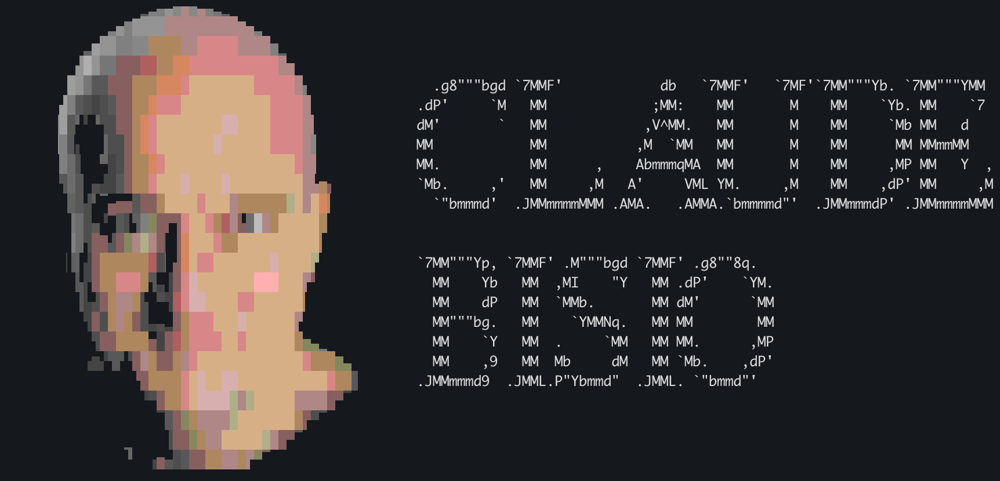

# claude-bisio

A zsh wrapper that prints a Claudio Bisio banner before launching the [Claude Code](https://claude.com/claude-code) CLI.

Claudio Bisio greets you every time you run `claude`. The banner auto-fits the terminal viewport: portrait rendered via [`chafa`](https://hpjansson.org/chafa/), with composed `CLAUDE` / `BISIO` figlet titles. Falls back to a static ASCII portrait if `chafa` isn't installed.



## Quick install

One paste - installs `chafa` (via your package manager), clones the plugin to `~/.claude-bisio`, and wires it into `~/.zshrc`:

```sh
curl -fsSL https://raw.githubusercontent.com/Evobaso-J/claude-bisio/main/install.sh | sh
```

Prefer not to pipe `curl` into `sh`? Same result, two steps:

```sh
git clone https://github.com/Evobaso-J/claude-bisio ~/.claude-bisio
~/.claude-bisio/install.sh
```

Then `exec zsh`.

Supported: macOS (Homebrew), Linux (`apt-get` / `dnf` / `pacman` / `zypper` / `apk`). Windows: use WSL.

## Plugin manager install

Install `chafa` first:

```sh
brew install chafa            # macOS
sudo apt-get install chafa    # Debian/Ubuntu
sudo dnf install chafa        # Fedora/RHEL
sudo pacman -S chafa          # Arch
```

Then add one line to `~/.zshrc`:

```sh
# zinit
zinit light Evobaso-J/claude-bisio

# antigen
antigen bundle Evobaso-J/claude-bisio

# zplug
zplug "Evobaso-J/claude-bisio"

# sheldon (~/.config/sheldon/plugins.toml)
[plugins.claude-bisio]
github = "Evobaso-J/claude-bisio"
```

`exec zsh`.

### oh-my-zsh custom plugin

Install `chafa` (see above), then:

```sh
git clone https://github.com/Evobaso-J/claude-bisio \
  "${ZSH_CUSTOM:-$HOME/.oh-my-zsh/custom}/plugins/claude-bisio"
```

Add `claude-bisio` to `plugins=(...)` in `~/.zshrc`. `exec zsh`.

## Usage

After install, run `claude` as usual. Banner prints once per invocation, then the real Claude Code CLI starts. All arguments are forwarded.

```sh
claude --version
claude -p "refactor this function"
```

Standalone preview: `bisio`.

## Disable

Remove the plugin entry (zinit/antigen/zplug/sheldon/oh-my-zsh) or delete the `source` line (manual install) from your config. Bypass for one invocation: `command claude ...`.

## Requirements

- `zsh`
- [`claude`](https://claude.com/claude-code) on `$PATH`
- Interactive terminal (banner auto-skips for pipes and non-TTYs)
- [`chafa`](https://hpjansson.org/chafa/) recommended - installed automatically by `install.sh`. Without it, a static ASCII fallback prints and a one-time install hint is shown.

## Configuration

`chafa` flags live in [`bin/banner.config.sh`](bin/banner.config.sh): symbol set, color depth, dithering, fg-only, etc. Edit, save, run `claude` - render cache auto-invalidates on flag change.

Layout picks itself based on terminal size:

- **side** - portrait left, titles right (wide terminals)
- **stacked** - portrait above, titles centered below (tall, narrow)
- **solo** - portrait only (very small)

## Roadmap

- v0.4: `CLAUDE_BISIO_QUIET`, `CLAUDE_BISIO_CENTER`, subcommand CLI

## License

MIT - see [LICENSE](LICENSE).

Source portrait: `assets/bisio.png`.
